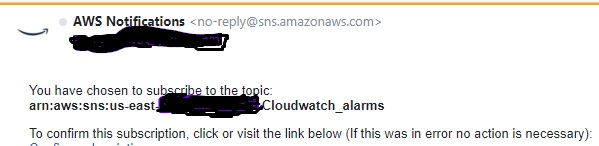
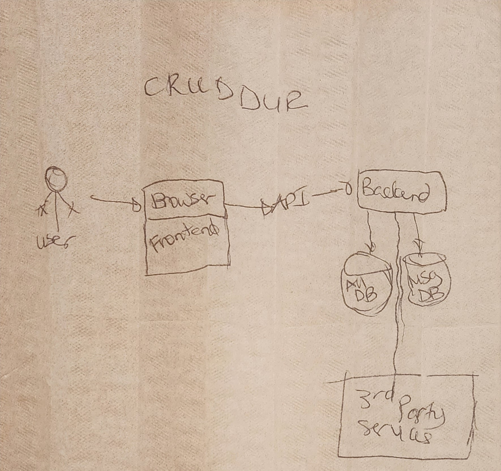

# Week 0 — Billing and Architecture
## <center>Billing </center>
As part of your AWS subcription, you have to keep cost in 
mind and detect any anomalies to your account. **You should configure immediate alerts via SNS and alert on anomalous spend patterns across your deployed AWS services.**  


**Billing Alarm example**


## <center> Security Considerations</center>
**Top security best practices**
1.	Data protection and residency in accordance with security policy
2.	Identity and access management with least privilege
3.	Governance and compliance of AWS Services being used such as Global vs Regional Services and Compliant Services
4.	Shared Responsibility of Threat Detection
5.	Incident Response Plans should include Cloud
6. Key Management and rotation for your secrets

## <center>Architecture </center>
**Crudder Conceptual Diagram on a Napkin**


**Crudder Conceptual Architectural Design in Lucid** 

[Conceptual Diagram](https://lucid.app/lucidchart/invitations/accept/inv_9601902e-6fc9-457b-bcb1-83b8a61d8540)


**Cruddur Logical Architectural Design in Lucid** 

[Logical Diagram](https://lucid.app/lucidchart/invitations/accept/inv_2e46f0c5-81e6-4ecc-80a1-889bed67465c)


## Create an Admin User
-	Create AWS account and sign in as Root 
-	Click IAM and setup MFA for Root account security
-	Created a new admin user with “Administrator Access” added to the Admin group
-	Enable AWS console access for this new admin  
-	Click new admin user and Create Access Keys
-	Choose AWS CLI Access and save credentials.
### Assign MFA to New User
-	Logout from Root user and login as new admin user 
-	Setup MFA for this admin account

## Install AWS CLI
[CLI reference](https://docs.aws.amazon.com/cli/latest/)

[AWS CLI Install guide](https://docs.aws.amazon.com/cli/latest/userguide/getting-started-install.html)
### Install AWS CLI for GitPod 
-	Updated the `.gitpod.yml` file with the following task so AWS CLI runs in partial auto-prompt mode in GitPod upon launching of the GitPod environment.
```sh
tasks:
  - name: aws-cli
    env:
      AWS_CLI_AUTO_PROMPT: on-partial
    init: |
      cd /workspace
      curl "https://awscli.amazonaws.com/awscli-exe-linux-x86_64.zip" -o "awscliv2.zip"
      unzip awscliv2.zip
      sudo ./aws/install
      cd $THEIA_WORKSPACE_ROOT
```

**UPDATED gitpod file** 
[gitpod.yml](https://github.com/cyberfly5/aws-bootcamp-cruddur-2023/main/.gitpod.yml)

## Use AWS CloudShell
-	Login as Admin and launch AWS Cloudshell in the browser
-	Verify that admin credentials are associated with AWS CLI session by running this command “aws –cli -auto-prompt”
-	Ensure that AWS CLI picks up current credentials by running this command “aws sts get-caller-identity”

```sh
aws sts get-caller-identity
```

## Setup Gitpod in GitHub 
Gitpod to be used as browser for VSCode that can be configured to load automatically from a GitHub account with a modified gitpod.yml 

1.	Add https://gitpod.io/# in front of my git hub account URL and confirmed the Workspace creation.
2.	Use Gitpod extension by pressing on green Gitpod button to open repository files on a new workspace that uses a VSCode browser.

## Assign Environment Variables to Security Credentials
Setup security credentials for the Bash Terminal in GitPod.  

```sh
export AWS_ACCESS_KEY_ID=""
export AWS_SECRET_ACCESS_KEY=""
export AWS_DEFAULT_REGION=us-east-1
```
