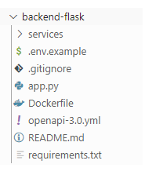
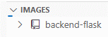
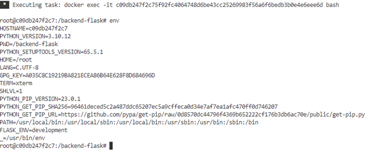
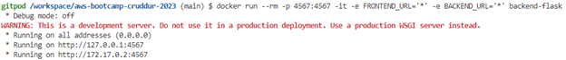
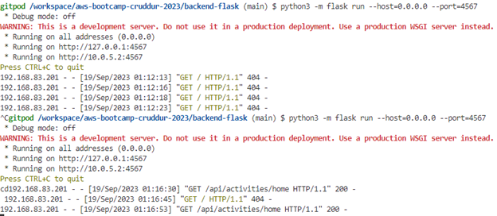
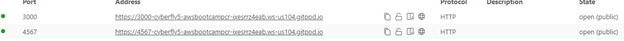
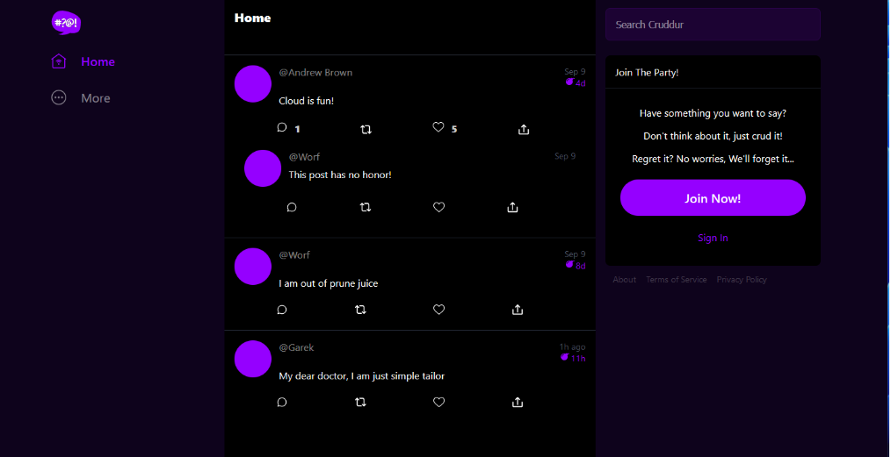
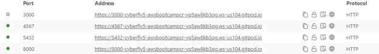
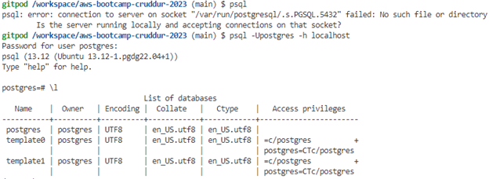

# Week 1 — App Containerization

## Docker Container Security Best Practice

Containers provide portability, efficiency and scalability for cloud native applications. Security of APIs, applications, microservices, and data should be considered as early as possible to ensure that container environments are protected against breaches, malware and malicious threat actors.

**Container Security Components**
- Docker & Host Configuration
- Image Security
- Management of Secrets
- Application Security
- Data Security
- Container Monitoring
- Compliance Framework

**Top 10 Container Security Best Practice**
1. Keep Host & Docker updated with Latest Security Patches.
2. Docker Daemon & containers should run in non-root mode to prevent container escape.
3. Use Secret Management Services, rotate keys and Share Secrets via tools like [HashiCorp Vault](https://www.vaultproject.io/) or [AWS Secrets Manager](https://aws.amazon.com/secrets-manager/).
4. Implement Read-Only File Systems and Volumes for Docker Containers.
5. Perform Docker Image Vulnerability Scanning with tools such as [Clair](https://www.redhat.com/en/topics/containers/what-is-clair) or [Snyk](https://snyk.io/).
6. Utilize DevSecOps Practices for Application Security.
7. Test Code for Vulnerabilities before Production by using tools like [Amazon Inspector](https://aws.amazon.com/inspector/).
8. Trust a Private vs Public Image Registry.
9. Avoid Storing Sensitive Data in Docker files or Images.
10. Keep Databases for Long-Term Storage Separate.

**Testing Docker Container Example**
- Create a Docker container following this [guide](https://docs.docker.com/compose/gettingstarted/) 
- Install [Snyk CLI](https://docs.snyk.io/snyk-cli/install-the-snyk-cli)
- Use Snyk command `snyk container test <container_name>` to test your Docker image or Use Snyk website for container security assessment.

**Running Containers in AWS**

To address limitations with Docker and simplify deployment, consider automating Blue/Green deployments and using managed container services such as:
- AWS Elastic Kubernetes Service (EKS)
- AWS App Runner
- AWS CoPilot
- AWS Elastic Container Service (ECS)
- AWS Fargate (Serverless Service)

## Containerize Backend
Note:  `workdir` container command is referring to /backend-flask within the container and the container shares the host operating system kernel.

- Backend Containerized Dockerfile based off the following image file:


```sh
FROM python:3.10-slim-buster
WORKDIR /backend-flask
COPY requirements.txt requirements.txt
RUN pip3 install -r requirements.txt
COPY . .
ENV FLASK_ENV=development
EXPOSE ${PORT}
CMD [ "python3", "-m" , "flask", "run", "--host=0.0.0.0", "--port=4567"]
```

### Add Dockerfile and install Python
- Working from inside Container
- Make a new folder 
- WORKDIR /backend-flask
FROM python:3.10-slim-buster
- Outside Container -> Inside Container
&NewLine;
&NewLine;
&nbsp;

- This contains the libraries to install to run the Cruddur app
- Install the python libraries used for the app

- RUN pip3 install -r requirements.txt
```sh
Pip3 install -r requirements.txt
```
- Next I ran the python3 flask module with local host and port 4567
- cmd (command), -m for module (flask)
- CMD [ "python3", "-m" , "flask", "run", "--host=0.0.0.0", "--port=4567"]
```sh
 python3 -m flask run –host=0.0.0.0  --port 4567
```


**Build Docker Backend-Flask Container**

docker build -t backend-flask ./backend-flask  # -t =tag


**Right click the backend-flask and attach container**

**Run backend-flask container**

**Prove of running python flask module and 404 error code**


- Click on the URL under PORTs tab to open port 4567 and add `/api/activities/home` example: https://4567-cyberfly5-awsbootcampcr-ixesrrz4eab.ws-us104.gitpod.io/api/activities/home and got the following JSON output: 


[{"created_at":"2023-09-17T01:16:53.904508+00:00","expires_at":"2023-09-24T01:16:53.904508+00:00","handle":"Andrew Brown","likes_count":5,"message":"Cloud is fun!","replies":[{"created_at":"2023-09-17T01:16:53.904508+00:00","handle":"Worf","likes_count":0,"message":"This post has no honor!","replies_count":0,"reply_to_activity_uuid":"68f126b0-1ceb-4a33-88be-d90fa7109eee","reposts_count":0,"uuid":"26e12864-1c26-5c3a-9658-97a10f8fea67"}],"replies_count":1,"reposts_count":0,"uuid":"68f126b0-1ceb-4a33-88be-d90fa7109eee"},{"created_at":"2023-09-12T01:16:53.904508+00:00","expires_at":"2023-09-28T01:16:53.904508+00:00","handle":"Worf","likes":0,"message":"I am out of prune juice","replies":[],"uuid":"66e12864-8c26-4c3a-9658-95a10f8fea67"},{"created_at":"2023-09-19T00:16:53.904508+00:00","expires_at":"2023-09-19T13:16:53.904508+00:00","handle":"Garek","likes":0,"message":"My dear doctor, I am just simple tailor","replies":[],"uuid":"248959df-3079-4947-b847-9e0892d1bab4"}]

- Remove backend-flask container


- Set frontend and backend environment variable for the endpoints which will remain set when the container is running.

```sh
export FRONTEND_URL="*"
```
```sh
export BACKEND_URL="*"
```
## Containerize Frontend
- Change directory to ‘frontend-react-js/`
```sh
cd frontend-react-js/
```

- Next run NPM install before building the frontend container because it needs to copy the contents of node modules
```sh
npm i
```

- Change back to the main directory (aws-bootcamp-cruddur-2023)
```sh
cd ..
```

- Now create a docker file `front-end-react-js/Dockerfile`.
- Click on `frontend-react-js` directory in Gitpod, right click and choose NEW FILE.
- Name the new file `Dockerfile`.
- Copy and paste the following code into the newly created ‘Dockerfile`:
```sh
FROM node:16.18
ENV PORT=3000
COPY . /frontend-react-js
WORKDIR /frontend-react-js
RUN npm install
EXPOSE ${PORT}
CMD ["npm", "start"]
```
cd /workspace/aws-bootcamp-cruddur-2023/frontend-react-js

npm i

/workspace/aws-bootcamp-cruddur-2023/frontend-react-js/docker-compose.yml
- This Docker Compose file is a multi-container deployment with Infrastructure As Code (IAC) that makes it much easier to run containers that need to run together logically.
`docker-compose.yml` file:
```sh
version: "3.8"
services:
  backend-flask:
    environment:
      FRONTEND_URL: "https://3000-${GITPOD_WORKSPACE_ID}.${GITPOD_WORKSPACE_CLUSTER_HOST}"
      BACKEND_URL: "https://4567-${GITPOD_WORKSPACE_ID}.${GITPOD_WORKSPACE_CLUSTER_HOST}"
    build: ./backend-flask
    ports:
      - "4567:4567"
    volumes:
      - ./backend-flask:/backend-flask
  frontend-react-js:
    environment:
      REACT_APP_BACKEND_URL: "https://4567-${GITPOD_WORKSPACE_ID}.${GITPOD_WORKSPACE_CLUSTER_HOST}"
    build: ./frontend-react-js
    ports:
      - "3000:3000"
    volumes:
      - ./frontend-react-js:/frontend-react-js

# the name flag is a hack to change the default prepend folder
# name when outputting the image names
networks: 
  internal-network:
    driver: bridge
    name: cruddur
```
- Run `docker-compose up`
```sh
Docker-compose up
```

- The frontend container(s) is on port 3000
- The backend container(s) is on port 4567
- Make sure both are unlocked.



  - Click on the frontend URL and you will see the Cruddur application.
- We now have access to the web application.
- The frontend and backend can communicate with each other.



## Adding DynamoDB Local and Postgres

-	DynamoDb Local and Postgres will be used in future labs.
-	Bring them in as containers to be referenced externally.
-	Add both DynamoDB Local and Postgre to `docker-compose.yml` file.

```sh
db:
    image: postgres:13-alpine
    restart: always
    environment:
      - POSTGRES_USER=postgres
      - POSTGRES_PASSWORD=password
    ports:
      - '5432:5432'
    volumes: 
      - db:/var/lib/postgresql/data
```

-	DynamoDB Local:
 
```sh
services:
  dynamodb-local:
    # https://stackoverflow.com/questions/67533058/persist-local-dynamodb-data-in-volumes-lack-permission-unable-to-open-databa
    # We needed to add user:root to get this working.
    user: root
    command: "-jar DynamoDBLocal.jar -sharedDb -dbPath ./data"
    image: "amazon/dynamodb-local:latest"
    container_name: dynamodb-local
    ports:
      - "8000:8000"
    volumes:
      - "./docker/dynamodb:/home/dynamodblocal/data"
    working_dir: /home/dynamodblocal
```

-	Then add the following code to docker-compose to the very end of the file just below “name:cruddur”:
```sh
volumes:
  db:
    driver: local
```

-	`driver: local` in the db volume references the database volume ` db:/var/lib/postgresql/data` in the Postgres code. We’ll copy the database data and store it on locally.
-	Now, from ` ./docker/dynamodb:/home/dynamodblocal/data` code in DynamoDB Local the `./docker/dynamodb` maps to `/home/dynamodblocal/data`.
-	Run docker-compose.yml file with docker `compose up` to run DynamoDB Local and Postgres to see how they interact with the other services in the file.
-	Right-click on  `docker-compose.yml`
-	Click on `Compose Up` to run the services
-	Go to PORTS tab in Gitpod terminal that run DynamoDB and Postgres and unlock ports 4567, 5432, and 8000 to make them Public. 
-	DynamoDB Local is running on port 8000 and Postgres is running on port 5432.



-	After Postgres client is installed into Gitpod.
-	Place the following Postgres driver code into `gitpod.yml` right after “cd $THEIA….”  
```sh
  - name: postgres
    init: |
      curl -fsSL https://www.postgresql.org/media/keys/ACCC4CF8.asc|sudo gpg --dearmor -o /etc/apt/trusted.gpg.d/postgresql.gpg
      echo "deb http://apt.postgresql.org/pub/repos/apt/ `lsb_release -cs`-pgdg main" |sudo tee  /etc/apt/sources.list.d/pgdg.list
      sudo apt update
      sudo apt install -y postgresql-client-13 libpq-dev
```

-	Run each of the 4 lines of Postgres code SEPARATELY in the Bash Terminal.

**Run Postgres**



