# Week 2 — Distributed Tracing

## HoneyComb for Observability
Observability is a strategic imperative for software development. Observability gives developers the confidence to build quickly and deploy more often so that they can deliver more innovation. It also helps teams make critical upgrades and migrations to scale safely and stay ahead of the competition.  
- [HoneyComb](https://www.honeycomb.io/) is one of the tools used for Application Performance and Monitoring
- HoneyComb gives you insights for your applications and makes it easier to troubleshoot
- HoneyComb allows you to quickly analyze highly granular data to discover serious problems before users experience their adverse effects.

Login to ui.honeycomb.io to create an account and an environment

Then grab the API key from your honeycomb account and set Env Vars below:

```sh
export HONEYCOMB_API_KEY=""
export HONEYCOMB_SERVICE_NAME="Cruddur"
gp env HONEYCOMB_API_KEY=""
gp env HONEYCOMB_SERVICE_NAME="Cruddur" *NOT ADVISED* to set this
```
### Add Env Vars to backend-flask in docker compose

OTEL_SERVICE_NAME: 'backend-flask'

We are configuring OTEL (Open Telemetry to send to honeycomb). OTEL is part of Cloud Native Computing Foundation (CNCF) which is the open source, vendor -neutral hub of cloud native computing projects like Kubernetes.


OTEL_EXPORTER_OTLP_ENDPOINT: "https://api.honeycomb.io"
OTEL_EXPORTER_OTLP_HEADERS: "x-honeycomb-team=${HONEYCOMB_API_KEY}"

x means custom in this case

### Go to honeycomb Python tab and follow install instructions
1. Install Packages
First, install the Honeycomb OpenTelemetry Distro packages to instrument your application with OpenTelemetry:

```
pip install opentelemetry-api
```
2. Next, install the instrumentation libraries for packages used in your application:
We'll add the following files to our `requirements.txt`

```
opentelemetry-api 
opentelemetry-sdk 
opentelemetry-exporter-otlp-proto-http 
opentelemetry-instrumentation-flask 
opentelemetry-instrumentation-requests
```
3. We'll install these dependencies:

```sh
pip install -r requirements.txt
```
Instrumentation requests are python http calls. Also, it's good practice to add API version for telemetry

4. Add to the `app.py`

```py
from opentelemetry import trace
from opentelemetry.instrumentation.flask import FlaskInstrumentor
from opentelemetry.instrumentation.requests import RequestsInstrumentor
from opentelemetry.exporter.otlp.proto.http.trace_exporter import OTLPSpanExporter
from opentelemetry.sdk.trace import TracerProvider
from opentelemetry.sdk.trace.export import BatchSpanProcessor
```

```py
# Initialize tracing and an exporter that can send data to Honeycomb
provider = TracerProvider()
processor = BatchSpanProcessor(OTLPSpanExporter())
provider.add_span_processor(processor)
trace.set_tracer_provider(provider)
tracer = trace.get_tracer(__name__)
```
```py
# Initialize automatic instrumentation with Flask
app = Flask(__name__)
FlaskInstrumentor().instrument_app(app)
RequestsInstrumentor().instrument()
```
**cd /frontend-react-js and run npm i**

gitpod /workspace/aws-bootcamp-cruddur-2023/frontend-react-js (main) $ npm i

**Linux distro to consider for Production security**
- Use slim baseline like [Alpine](https://www.alpinelinux.org/) to reduce the attack surface
- Consider redundancy, stability, speed and a secure enviroment

**cd.. and run docker compose up to build the containers**
- Proof of running containers


**Add additional code to 'gitpod.yml' to automatically open ports below:**


**click the frontend(3000) link to launch the app**

**click the backend(4567) link and append /api/activities/home to see the data**


### HoneyComb Dataset
- Modified app.py and home_activities to add spans and traces
- Added instrumentation to Honeycomb to add attributes and spans
- Ran a queries for traces and heatmap

**Traces for hard-coded query from home_activities of backend-flask**

**Heatmap query example**


## Observability Security Considerations
1. Know your WHY?

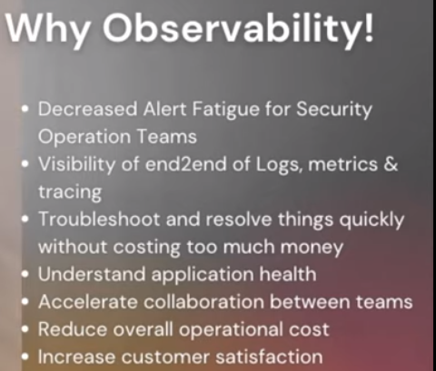

2. Take inventory of your current environment
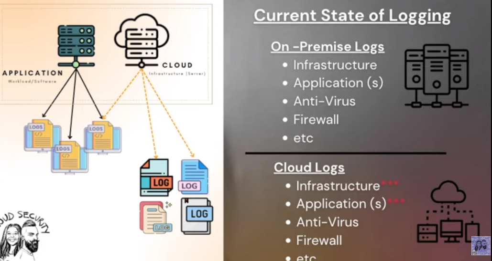
3. Gain Visibility and Secure your networks

4. Insights Discovery Process

5. Consider a SIEM and/or MDR solution for security operations
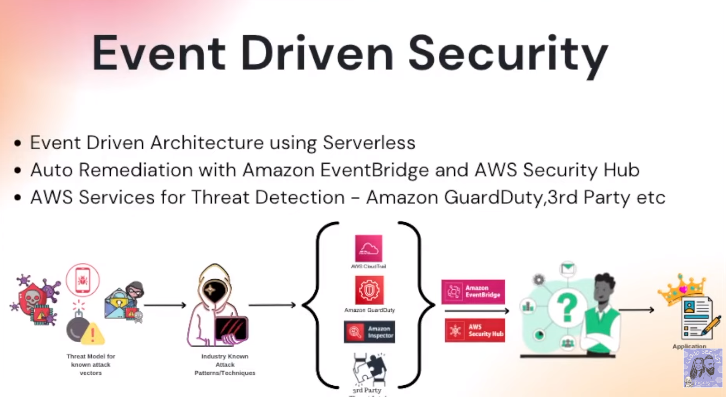
## Instrument AWS X-Ray
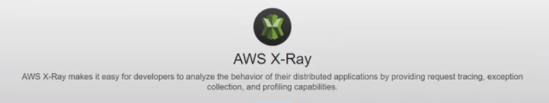

**X-Ray Components**
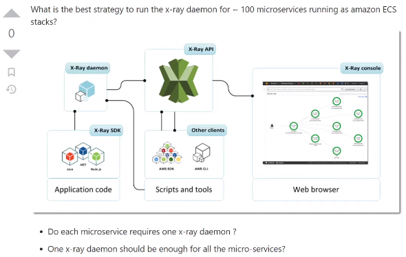

**Add AWS X-RAY SDK**

Update backend 'requirements.txt' with this command

```py
aws-xray-sdk
```

**Install SDK**

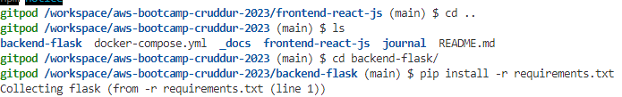

**Add Middleware for tracing**
```py
from aws_xray_sdk.core import xray_recorder
from aws_xray_sdk.ext.flask.middleware import XRayMiddleware

xray_url = os.getenv("AWS_XRAY_URL")
xray_recorder.configure(service='backend-flask', dynamic_naming=xray_url)
XRayMiddleware(app, xray_recorder)
```
###  Setup AWS X-Ray Resources

Add `aws/json/xray.json`

```json
{
  "SamplingRule": {
      "RuleName": "Cruddur",
      "ResourceARN": "*",
      "Priority": 9000,
      "FixedRate": 0.1,
      "ReservoirSize": 5,
      "ServiceName": "backend-flask",
      "ServiceType": "*",
      "Host": "*",
      "HTTPMethod": "*",
      "URLPath": "*",
      "Version": 1
  }
}
```
### AWS XRAY Sampling Rule
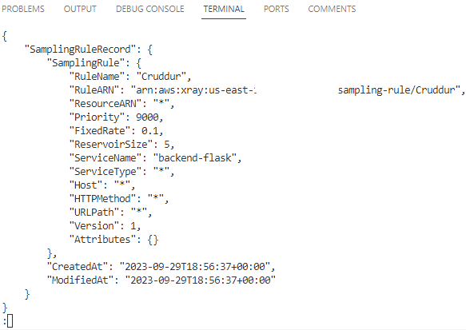

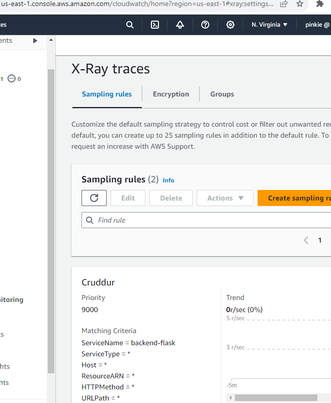

### Add XRAY Daemon Service to Docker Compose

```yml
  xray-daemon:
    image: "amazon/aws-xray-daemon"
    environment:
      AWS_ACCESS_KEY_ID: "${AWS_ACCESS_KEY_ID}"
      AWS_SECRET_ACCESS_KEY: "${AWS_SECRET_ACCESS_KEY}"
      AWS_REGION: "us-east-1"
    command:
      - "xray -o -b xray-daemon:2000"
    ports:
      - 2000:2000/udp
```
Then add these two env vars to our backend-flask in our `docker-compose.yml` file

```yml
      AWS_XRAY_URL: "*4567-${GITPOD_WORKSPACE_ID}.${GITPOD_WORKSPACE_CLUSTER_HOST}*"
      AWS_XRAY_DAEMON_ADDRESS: "xray-daemon:2000"
```
## CloudWatch Logs


Add to the `requirements.txt`

```
watchtower
```

```sh
pip install -r requirements.txt
```
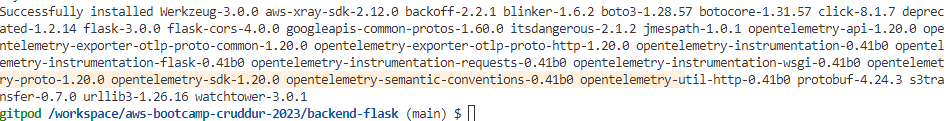

**Successfully got Cloudwatch to log**

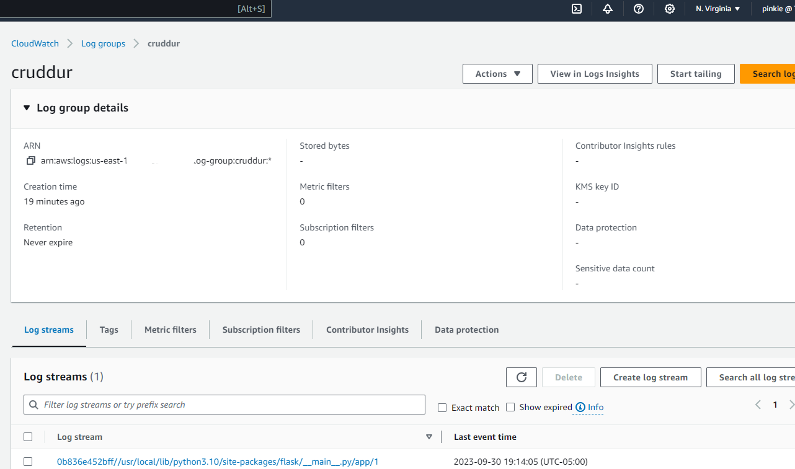

**Test Log passed to API endpoint**

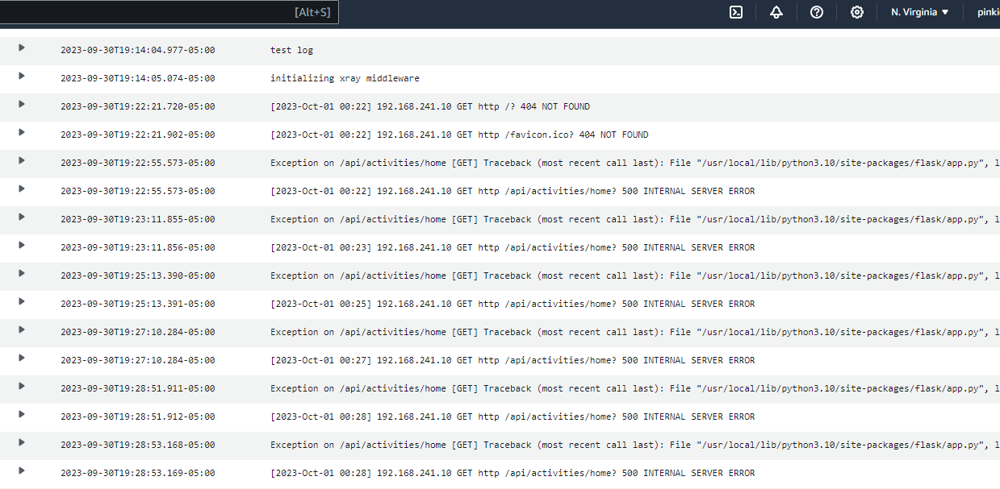

## Implement Rollbar Error Logging

https://rollbar.com/

Add SDK and select Flask Framework

Create a new project in Rollbar called `Cruddur`

Add to `requirements.txt`


```
blinker
rollbar
```

**Install Dependencies**

```sh
pip install -r requirements.txt
```
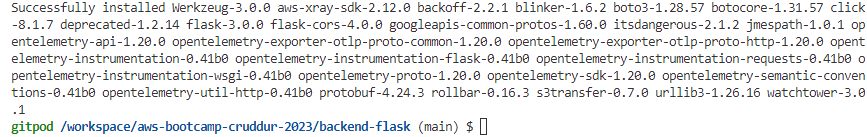

We need to set our access token

```sh
export ROLLBAR_ACCESS_TOKEN=""
gp env ROLLBAR_ACCESS_TOKEN=""
```
Import for Rollbar

```py
import rollbar
import rollbar.contrib.flask
from flask import got_request_exception
```
```py
rollbar_access_token = os.getenv('ROLLBAR_ACCESS_TOKEN')
@app.before_first_request
def init_rollbar():
    """init rollbar module"""
    rollbar.init(
        # access token
        rollbar_access_token,
        # environment name
        'production',
        # server root directory, makes tracebacks prettier
        root=os.path.dirname(os.path.realpath(__file__)),
        # flask already sets up logging
        allow_logging_basic_config=False)

    # send exceptions from `app` to rollbar, using flask's signal system.
    got_request_exception.connect(rollbar.contrib.flask.report_exception, app)
```

Add an endpoint for testing rollbar to `app.py`

```py
@app.route('/rollbar/test')
def rollbar_test():
    rollbar.report_message('Hello World!', 'warning')
    return "Hello World!"
```
**Rollbar Flask Example**

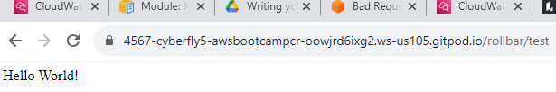

Rollbar Listening for errors 

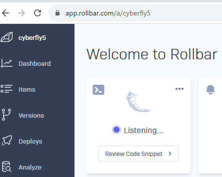
