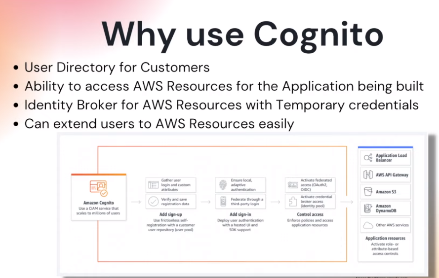
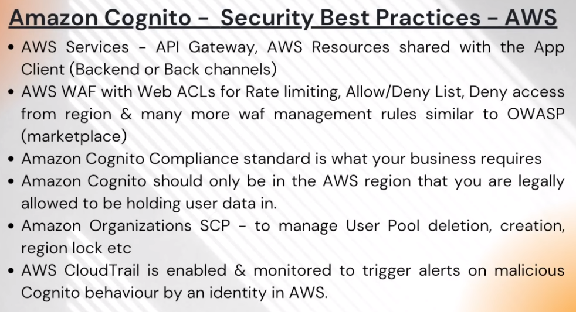
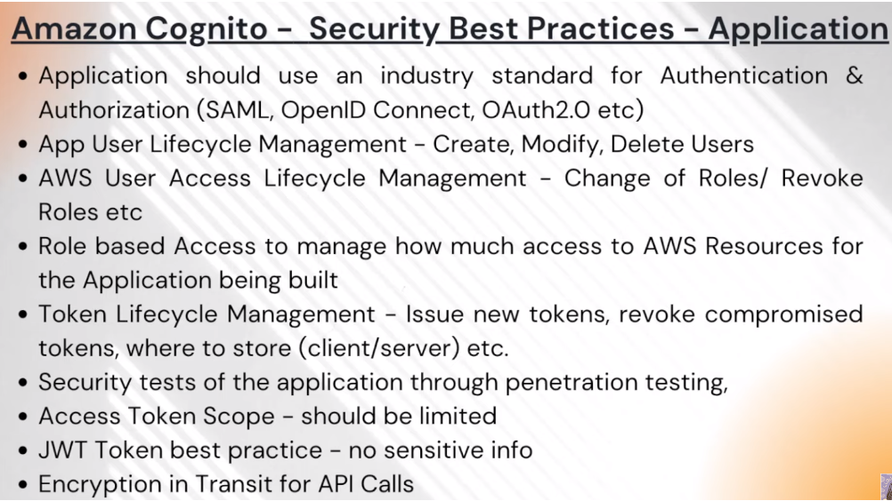
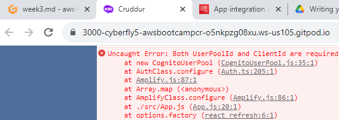
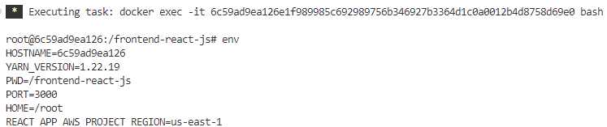

# Week 3 — Decentralized Authentication
**Class Summary**
- Provision via ClickOps an Amazon Cognito User Pool
- Install and configure Amplify client-side library for Amazon Cognito
- Implement API calls to Amazon Cognito for custom login, signup, recovery and forgot password page
- Show conditional elements and data based on logged in or logged out
- Verify JWT Token server side to serve authenticated API endpoints in Flask Application

**Decentralized Authentication** is the key to advancing in the future, and now it depends on how you try to implement it. Decentralized authentication simply means that there is no central authority needed to verify your identity. Decentralized Identifiers are a special type of identifier (ID) that allows for decentralized, verified digital identification. A DID is any subject identified by the DID's controller (e.g., a person, organization, thing, data model, abstract entity, etc.). Decentralized Authentication uses protocols such as [OpensID](https://openid.net/)


**AWS Security Identity Access Management**




**AWS Security Considerations**



**Application Security Considerations**



## Install AWS Amplify

```sh
npm i aws-amplify --save
```

## Provision Cognito User Group

Using the AWS Console we'll create a Cognito User Group

## Configure Amplify

We need to hook up our cognito pool to our code in the `App.js`

```js
import { Amplify } from 'aws-amplify';

Amplify.configure({
  "AWS_PROJECT_REGION": process.env.REACT_APP_AWS_PROJECT_REGION,
  "aws_cognito_region": process.env.REACT_APP_AWS_COGNITO_REGION,
  "aws_user_pools_id": process.env.REACT_APP_AWS_USER_POOLS_ID,
  "aws_user_pools_web_client_id": process.env.REACT_APP_CLIENT_ID,
  "oauth": {},
  Auth: {
    // We are not using an Identity Pool
    // identityPoolId: process.env.REACT_APP_IDENTITY_POOL_ID, // REQUIRED - Amazon Cognito Identity Pool ID
    region: process.env.REACT_AWS_PROJECT_REGION,           // REQUIRED - Amazon Cognito Region
    userPoolId: process.env.REACT_APP_AWS_USER_POOLS_ID,         // OPTIONAL - Amazon Cognito User Pool ID
    userPoolWebClientId: process.env.REACT_APP_AWS_USER_POOLS_WEB_CLIENT_ID,   // OPTIONAL - Amazon Cognito Web Client ID (26-char alphanumeric string)
  }
});
```
## Conditionally show components based on logged in or logged out

Inside our `HomeFeedPage.js`

```js
import { Auth } from 'aws-amplify';

// set a state
const [user, setUser] = React.useState(null);

// check if we are authenicated
const checkAuth = async () => {
  Auth.currentAuthenticatedUser({
    // Optional, By default is false. 
    // If set to true, this call will send a 
    // request to Cognito to get the latest user data
    bypassCache: false 
  })
  .then((user) => {
    console.log('user',user);
    return Auth.currentAuthenticatedUser()
  }).then((cognito_user) => {
      setUser({
        display_name: cognito_user.attributes.name,
        handle: cognito_user.attributes.preferred_username
      })
  })
  .catch((err) => console.log(err));
};

// check when the page loads if we are authenicated
React.useEffect(()=>{
  loadData();
  checkAuth();
}, [])
```
We'll update `ProfileInfo.js`

```js
import { Auth } from 'aws-amplify';

const signOut = async () => {
  try {
      await Auth.signOut({ global: true });
      window.location.href = "/"
  } catch (error) {
      console.log('error signing out: ', error);
  }
}
```
**Test Frontend App to make sure it works after making the above changes**

Got blank page with errors below and had to check our Env Vars for authentication



**Get into Frontend container shell and verify AWS Env Vars**



**Fixed AWS Env Vars and restarted docker**


## Signin Page

```js
import { Auth } from 'aws-amplify';


const onsubmit = async (event) => {
  setErrors('')
  event.preventDefault();
  try {
    Auth.signIn(email, password)
      .then(user => {
        localStorage.setItem("access_token", user.signInUserSession.accessToken.jwtToken)
        window.location.href = "/"
      })
      .catch(err => { console.log('Error!', err) });
  } catch (error) {
    if (error.code == 'UserNotConfirmedException') {
      window.location.href = "/confirm"
    }
    setCognitoErrors(error.message)
  }
  return false
}

let errors;
if (cognitoErrors){
  errors = <div className='errors'>{cognitoErrors}</div>;
}

// just before submit component
{errors}
```
## Signup Page

```js
import { Auth } from 'aws-amplify';

const [cognitoErrors, setCognitoErrors] = React.useState('');

const onsubmit = async (event) => {
  event.preventDefault();
  setCognitoErrors('')
  try {
      const { user } = await Auth.signUp({
        username: email,
        password: password,
        attributes: {
            name: name,
            email: email,
            preferred_username: username,
        },
        autoSignIn: { // optional - enables auto sign in after user is confirmed
            enabled: true,
        }
      });
      console.log(user);
      window.location.href = `/confirm?email=${email}`
  } catch (error) {
      console.log(error);
      setCognitoErrors(error.message)
  }
  return false
}

## Confirmation Page

```js
import { Auth } from 'aws-amplify';

const resend_code = async (event) => {
  setCognitoErrors('')
  try {
    await Auth.resendSignUp(email);
    console.log('code resent successfully');
    setCodeSent(true)
  } catch (err) {
    // does not return a code
    // does cognito always return english
    // for this to be an okay match?
    console.log(err)
    if (err.message == 'Username cannot be empty'){
      setCognitoErrors("You need to provide an email in order to send Resend Activiation Code")   
    } else if (err.message == "Username/client id combination not found."){
      setCognitoErrors("Email is invalid or cannot be found.")   
    }
  }
}

const onsubmit = async (event) => {
  event.preventDefault();
  setCognitoErrors('')
  try {
    await Auth.confirmSignUp(email, code);
    window.location.href = "/"
  } catch (error) {
    setCognitoErrors(error.message)
  }
  return false
}
```