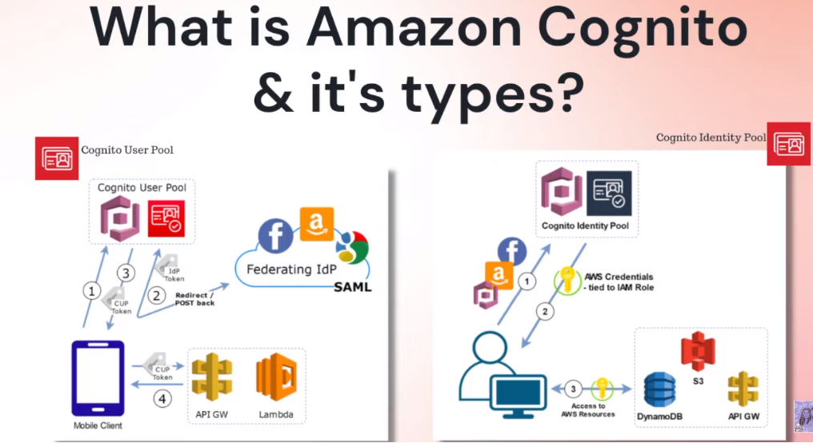

# Week 3 — Decentralized Authentication
**Class Summary**
- Provision via ClickOps a Amazon Cognito User Pool
- Install and configure Amplify client-side library for Amazon Congito
- Implement API calls to Amazon Coginto for custom login, signup, recovery and forgot password page
- Show conditional elements and data based on logged in or logged out
- Verify JWT Token server side to serve authenticated API endpoints in Flask Application

**Decentralized Authentication** is the key to advancing in the future, and now it depends on how you try to implement it. Decentralized authentication simply means that there is no central authority needed to verify your identity. Decentralized Identifiers are a special type of identifier (ID) that allows for decentralized, verified digital identification. A DID is any subject identified by the DID's controller (e.g., a person, organization, thing, data model, abstract entity, etc.). Decentralized Authentication uses protocols such as [OpensID](https://openid.net/)

**AWS Security Identity Access Management**

**AWS Security Considerations**

**Application Security Considerations**

